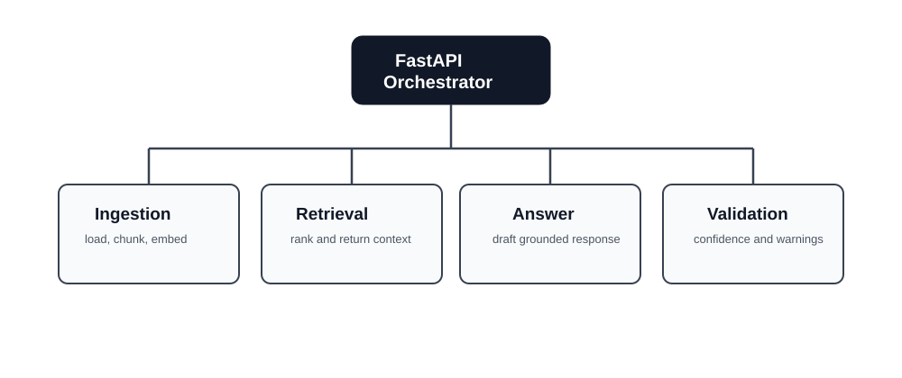
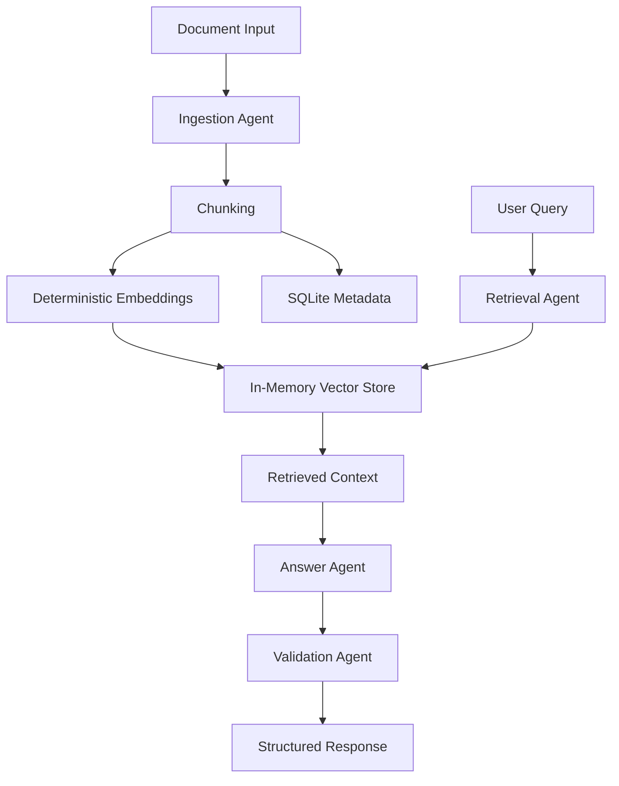

# AI RAG Agent Lab

A sanitized Python/FastAPI demo for document retrieval, vector-like search and agentic workflows.




## Security Notice

This is a public portfolio demo. It does not include proprietary code, private prompts, client data, credentials, production routes, internal architecture, commercial rules or real legal material.

## What This Demonstrates

- Python backend development
- FastAPI APIs
- RAG pipeline design
- Document chunking
- Deterministic local embeddings
- Vector-like retrieval with lexical reranking
- SQL-backed metadata tracking with SQLite
- Agentic workflow structure
- Prompt management
- Structured logging
- pytest tests
- Docker setup

## Engineering Standards

- Python modules are intentionally small and focused.
- Source files stay well below 350 lines whenever possible.
- Each agent owns one responsibility.
- Retrieval, ingestion, schema, configuration and API orchestration are separated.
- The code favors reviewability over framework magic.

## Architecture



## Run Locally

```bash
python -m venv .venv
source .venv/bin/activate
pip install -r requirements.txt
uvicorn app.main:app --reload
```

On Windows PowerShell:

```powershell
python -m venv .venv
.\.venv\Scripts\Activate.ps1
pip install -r requirements.txt
uvicorn app.main:app --reload
```

## Run With Docker

```bash
docker compose up --build
```

## API Examples

Index the sample documents:

```bash
curl -X POST http://localhost:8000/documents/index \
  -H "Content-Type: application/json" \
  -d "{\"use_sample_data\": true}"
```

Ask a question:

```bash
curl -X POST http://localhost:8000/query \
  -H "Content-Type: application/json" \
  -d "{\"question\":\"How does the workflow validate answers?\",\"top_k\":3}"
```

Health check:

```bash
curl http://localhost:8000/health
```

## Intentional Limitations

- In-memory vector storage
- Mocked deterministic embeddings
- No production secrets
- No proprietary workflows
- No real legal data
- No external LLM call by default
- No production auth layer

## Professional Context

This demo reflects experience with document-heavy AI systems, retrieval pipelines, context engineering, validation gates and agentic workflows. It is intentionally sanitized so public reviewers can assess engineering fundamentals without exposing proprietary systems, client information, private prompts or commercial implementation details.

## Where Production Systems Would Extend This

- Replace deterministic embeddings with OpenAI, Gemini, Hugging Face or a local transformer model.
- Replace the in-memory store with Postgres/pgvector, FAISS, Qdrant or Pinecone.
- Add authentication, tenant isolation, rate limits and audit trails.
- Add asynchronous ingestion workers for large files.
- Add tracing, evaluation datasets and retrieval quality metrics.
