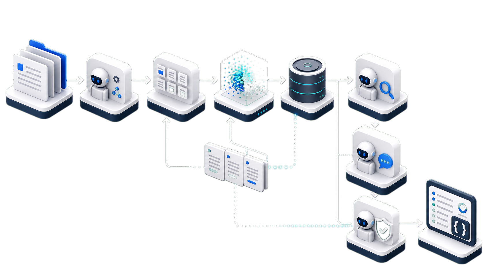
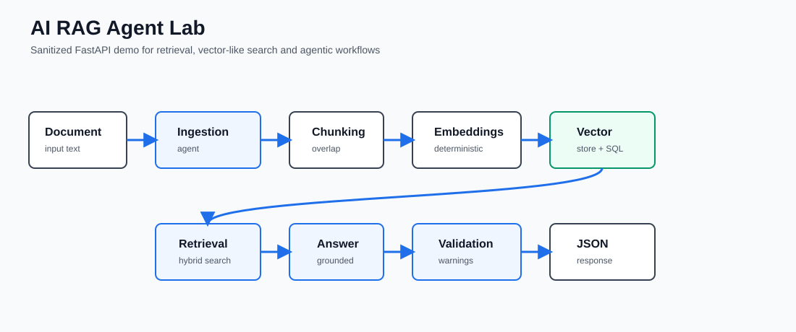
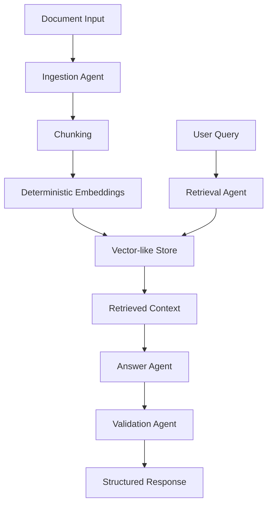

# AI RAG Agent Lab

[](https://github.com/HelderPetrica/ai-rag-agent-lab/actions/workflows/tests.yml)

Sanitized Python/FastAPI demo for document retrieval, vector-like search and agentic workflows.

> Public portfolio demo. No proprietary code, no private prompts, no credentials, no client data, no production routes and no commercial rules.

<p align="center">
  
</p>

<p align="center">
  
</p>

## TL;DR For Recruiters / Tech Leads

- FastAPI backend with typed Pydantic request and response models.
- Document ingestion with deterministic chunking and metadata.
- Local deterministic embeddings, so the demo runs without API keys.
- Hybrid retrieval plus answer and validation agents.
- pytest coverage, structured logging, Docker and GitHub Actions.

## Why This Repository Exists

This repository demonstrates the engineering shape of document-heavy GenAI systems without exposing private systems. It is intentionally small, synthetic and reproducible. The goal is to show judgment around RAG pipelines, API contracts, tests, security boundaries and maintainable Python.

## What It Demonstrates

- Python backend development
- FastAPI APIs
- RAG pipeline design
- Chunking
- Dense/vector-like retrieval
- Hybrid search
- Agentic workflow boundaries
- Prompt management
- Structured logging
- pytest tests
- Docker setup
- Security and sanitization mindset

## Engineering Standards

- Python modules are intentionally small and focused.
- Source files stay well below 350 lines whenever possible.
- Each agent owns one responsibility.
- Retrieval, ingestion, schema, configuration and API orchestration are separated.
- The code favors reviewability over framework magic.

## Architecture



## API Endpoints

- GET `/` - short service description.
- GET `/health` - health, service name, version and indexed chunk count.
- POST `/documents/index` - indexes sample documents or submitted plain text.
- POST `/query` - retrieves context, drafts an answer and validates confidence.

## Quickstart

```bash
python -m venv .venv
source .venv/bin/activate
pip install -r requirements.txt
uvicorn app.main:app --reload
```

On Windows PowerShell:

```powershell
python -m venv .venv
.\.venv\Scripts\Activate.ps1
pip install -r requirements.txt
uvicorn app.main:app --reload
```

## Docker

```bash
docker compose up --build
```

## Example Curl Commands

Health:

```bash
curl http://localhost:8000/health
```

Index sample documents:

```bash
curl -X POST http://localhost:8000/documents/index \
  -H "Content-Type: application/json" \
  -d "{\"use_sample_data\": true}"
```

Ask a question:

```bash
curl -X POST http://localhost:8000/query \
  -H "Content-Type: application/json" \
  -d "{\"question\":\"How does the workflow validate answers?\",\"top_k\":3}"
```

## Example Response

```json
{
  "answer": "Based on the retrieved demo context, the most relevant finding is: ...",
  "retrieved_context": [
    {
      "chunk_id": "demo_document_01::chunk-0",
      "document_id": "demo_document_01",
      "source": "sample_data/demo_document_01.txt",
      "text": "Acme Operations Handbook describes a document review workflow...",
      "score": 0.72,
      "metadata": {
        "chunk_index": 0,
        "token_count": 90
      }
    }
  ],
  "sources": ["sample_data/demo_document_01.txt"],
  "confidence": 0.72,
  "warnings": [],
  "metadata": {
    "service": "AI RAG Agent Lab",
    "top_k": 3,
    "indexed_chunks": 4,
    "retrieved_chunks": 1,
    "uses_external_llm": false
  }
}
```

## Tests

```bash
pytest
```

The test suite covers endpoint contracts, chunking, deterministic embeddings, vector store behavior, hybrid retrieval, answer validation, README command consistency and basic secret scanning.

## Production Mapping

This demo keeps production integrations out of the repository. A production version could replace or extend the current pieces with:

- Postgres and pgvector for durable vector search.
- FAISS, Qdrant or Pinecone for specialized retrieval.
- OpenAI, Gemini, Hugging Face or local embedding models.
- OCR or Document AI fallback for scanned documents.
- Async queues for ingestion and long-running parsing.
- Authentication, authorization and tenant isolation.
- Prompt versioning and evaluation datasets.
- Tracing, metrics and observability.
- Cost controls, rate limits and CI/CD release gates.

## Intentional Limitations

- In-memory vector-like storage.
- SQLite metadata only for lightweight demonstration.
- Deterministic embeddings instead of external model calls.
- Synthetic documents only.
- No external LLM calls by default.
- No real legal data.
- No proprietary workflows.

## Security

See [SECURITY.md](SECURITY.md).
