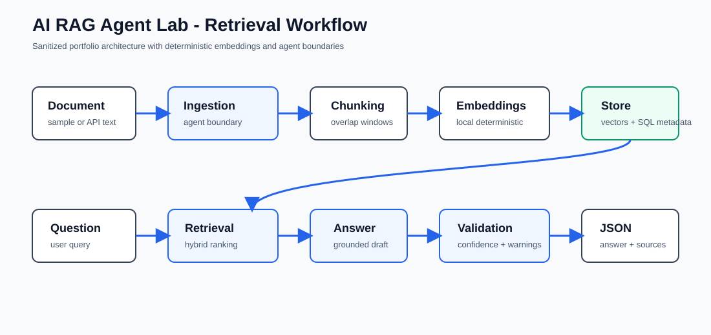

# Architecture Flow

The application uses a small but realistic RAG sequence:

1. Document input
2. Ingestion agent
3. Chunking
4. Deterministic embeddings
5. Vector-like storage
6. Retrieval agent
7. Answer agent
8. Validation agent
9. Structured API response

The design keeps data flow explicit so reviewers can inspect how the answer is grounded in retrieved context.

